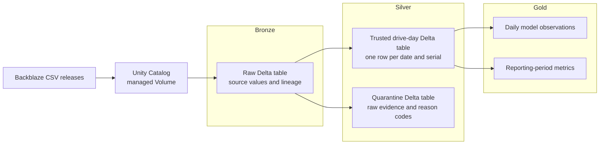
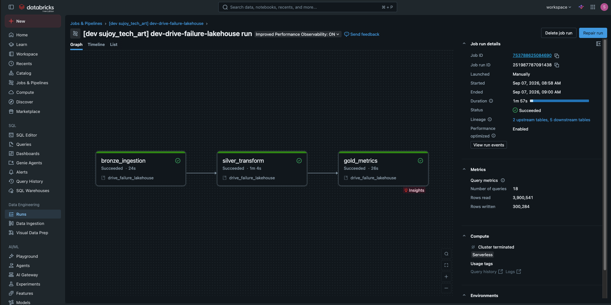
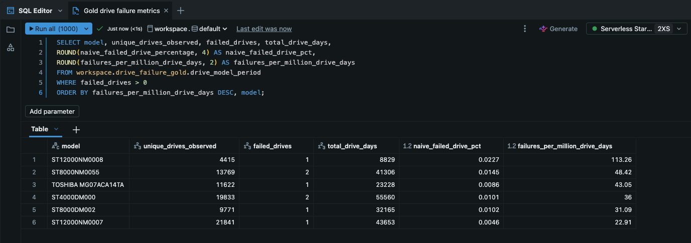
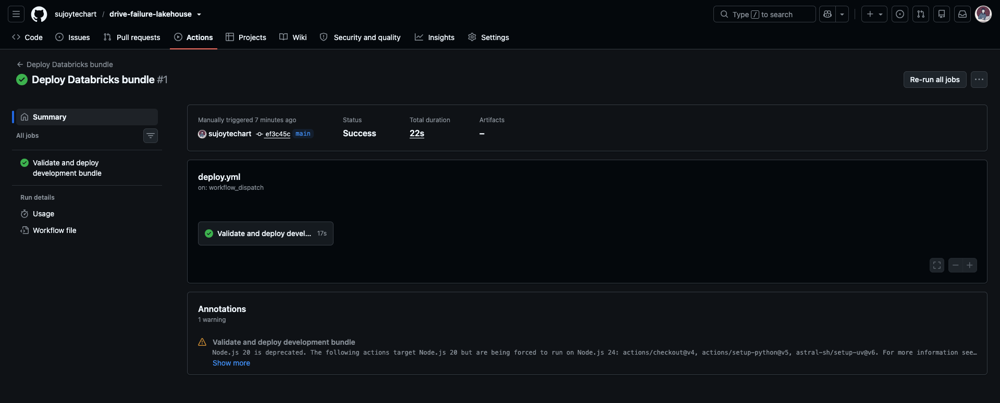

# Drive Failure Lakehouse

[](https://github.com/sujoytechart/drive-failure-lakehouse/actions/workflows/ci.yml)

A Databricks lakehouse pipeline that turns daily hard-drive observations into trusted,
exposure-aware reliability metrics. The project uses public
[Backblaze Drive Stats](https://www.backblaze.com/cloud-storage/resources/hard-drive-test-data)
data to demonstrate schema evolution, quarantine, deterministic correction handling,
idempotent Delta writes, workflow orchestration, and GitHub Actions delivery.

## What the data means

Backblaze records one row for every operational drive it observes each day. A row tells
us which physical drive was observed, its model and capacity, whether it failed on that
date, and its S.M.A.R.T. health readings. Those S.M.A.R.T. columns change between source
releases.

This is repeated-observation data. A model seen for 100,000 drive-days has more exposure
than one seen for 2,000 drive-days, so comparing failure counts alone is misleading. The
Gold layer therefore publishes both intuitive drive counts and failures per million
observed drive-days.

## Architecture



The visible data path is intentionally small. The engineering depth is inside the layer
boundaries: incremental discovery, immutable source revisions, stable schemas, explicit
rejection reasons, deterministic duplicate resolution, transactional writes, retries,
tests, and version-controlled deployment.

### Bronze: preserve what arrived

Auto Loader incrementally discovers CSV files in the landing Volume. Bronze retains raw
source values, rescued data, file identity, modification time, ingestion time, source
quarter, and source revision. Its checkpoint makes a normal rerun a no-op for files
already processed.

### Silver: decide what can be trusted

Silver validates core types and rules, then selects one record for each
`(date, serial_number)`. A higher source revision wins, followed by file modification
time and file name. Rows that cannot be trusted remain inspectable in quarantine with a
stable identifier and reason codes.

Changing wide columns such as `smart_5_raw` and `smart_187_normalized` become a stable
map:

```text
smart_attributes["187"] = {raw: 0, normalized: 100}
```

New S.M.A.R.T. attributes can therefore arrive without widening the trusted table on
every release.

### Gold: answer reliability questions

`drive_model_daily` contains additive daily observations at `(date, model)` grain.
`drive_model_period` contains one row per model for an explicit reporting window.

```text
naive failed-drive percentage
  = 100 × failed drives / unique drives observed

failures per million drive-days
  = 1,000,000 × failed drives / total observed drive-days
```

The second measure accounts for observation time, but it is an incidence rate. It is not
a lifetime failure probability or survival curve. Metrics produced from a bounded sample
describe that sample and should not be presented as fleet-wide Backblaze estimates.

## Engineering guarantees

- **Schema drift:** Bronze evolves additively. Silver normalizes S.M.A.R.T. columns into
  a typed map and exposes a stable public schema.
- **Bad data:** critical violations are retained in quarantine. Malformed optional
  readings become non-fatal warning codes.
- **Corrections:** immutable `release=YYYY-QN-rN` paths make source precedence explicit.
- **Replay safety:** Silver and quarantine use Delta `MERGE`. Gold tables are fully
  derived and atomically replaced.
- **Determinism:** revision, modification time, and file path define duplicate
  precedence. Unresolved top-ranked conflicts are quarantined.
- **Delivery:** typed wheel tasks and bundle resources are reviewed in Git, tested in CI,
  and deployed on demand through GitHub Actions.

The detailed design is in [the system design](docs/design/system-design.md). The
[architecture decision records](docs/adr/README.md) document consequential tradeoffs,
including Delta versus Iceberg or plain Parquet.

## Verified execution

The project was deployed to Databricks Free Edition and exercised with a bounded sample
of 300,000 Backblaze drive-day records. The three-task workflow completed from Bronze
through Silver to Gold on serverless compute. A second run without new source files
verified replay behavior: Auto Loader discovered no additional input, and the row counts
in every published table remained unchanged.



The Gold result exposes both raw failure counts and exposure-adjusted rates. This makes
the output useful for comparison while keeping the observed drive-day denominator clear.



The same version-controlled Databricks Asset Bundle was validated and deployed from
[GitHub Actions](https://github.com/sujoytechart/drive-failure-lakehouse/actions/workflows/deploy.yml).
The workflow uses protected environment secrets. Credentials are not stored in the
repository.



## Repository map

```text
src/drive_failure_lakehouse/       transformation and Delta write modules
src/drive_failure_lakehouse/jobs/  thin Databricks wheel-task entry points
resources/                         workflow, schemas, and managed Volume definitions
tests/unit/                        transformation and contract behavior
tests/integration/                 local Delta replay and correction behavior
scripts/                           developer environment and sampling entry points
docs/adr/                          architectural decisions and alternatives
docs/evidence/                     verified Databricks and delivery runs
```

## Local development

Requirements are Python 3.12, Java 17, `uv`, and Git. On macOS, `scripts/dev-env.sh`
selects Homebrew's OpenJDK 17.

```bash
cd drive-failure-lakehouse
uv sync --frozen --extra dev
source scripts/dev-env.sh
uv run ruff check .
uv run ruff format --check .
uv run mypy
uv run pytest --cov=drive_failure_lakehouse --cov-report=term-missing
```

These are the same quality gates executed by `.github/workflows/ci.yml` on pull requests
and pushes to `main`.

## Create a bounded source sample

The pipeline uses two distant quarters because their different S.M.A.R.T. columns
exercise real schema drift. The official archives are large, approximately 571 MB for
2019 Q1 and 1.01 GB for 2024 Q1. They remain local and `data/` is ignored by Git.

```bash
cd drive-failure-lakehouse
mkdir -p data/downloads data/extracted/2019 data/extracted/2024 data/samples
curl -fL https://f001.backblazeb2.com/file/Backblaze-Hard-Drive-Data/data_Q1_2019.zip -o data/downloads/data_Q1_2019.zip
curl -fL https://f001.backblazeb2.com/file/Backblaze-Hard-Drive-Data/data_Q1_2024.zip -o data/downloads/data_Q1_2024.zip
unzip -q data/downloads/data_Q1_2019.zip -d data/extracted/2019
unzip -q data/downloads/data_Q1_2024.zip -d data/extracted/2024
uv run sample-backblaze --input-dir data/extracted/2019 --output-dir data/samples --release 2019-Q1-r1 --rows-per-file 500
uv run sample-backblaze --input-dir data/extracted/2024 --output-dir data/samples --release 2024-Q1-r1 --rows-per-file 500
```

The sampler scans nested archive directories, processes files in stable path order,
preserves headers and file names, and writes a manifest containing source SHA-256 hashes
and row counts. It rejects duplicate file names rather than overwriting a sample.

For a minimal platform walkthrough without the large downloads, the two files in
`tests/fixtures/` can be uploaded under the corresponding release directories. They use
representative 2019 and 2024 schemas with synthetic rows. They are not analytical data.

## Deploy to Databricks

The default target uses a Unity Catalog catalog named `workspace`, three project schemas,
a managed Volume, serverless wheel tasks, and a paused weekly schedule. Override bundle
variables if the workspace uses different names.

1. Create a Databricks workspace and a GitHub environment named `databricks-dev`.
2. Add `DATABRICKS_HOST` and `DATABRICKS_TOKEN` as environment secrets.
3. In GitHub, open **Actions → Deploy Databricks bundle → Run workflow**.
4. Confirm that bundle validation, deployment, and resource summary all succeed.

The deployment creates the schemas and managed Volume before data is uploaded. It does
not run the pipeline or enable its schedule.

Authenticate the local CLI for file upload and controlled runs:

```bash
cd drive-failure-lakehouse
databricks auth login --host https://YOUR-WORKSPACE-HOST --profile drive-failure-dev
databricks fs cp data/samples/release=2019-Q1-r1 dbfs:/Volumes/workspace/drive_failure_bronze/drive_failure_files/landing/release=2019-Q1-r1 --recursive --profile drive-failure-dev
databricks fs cp data/samples/release=2024-Q1-r1 dbfs:/Volumes/workspace/drive_failure_bronze/drive_failure_files/landing/release=2024-Q1-r1 --recursive --profile drive-failure-dev
databricks bundle run --target dev platform_smoke --profile drive-failure-dev
databricks bundle run --target dev drive_failure_pipeline --profile drive-failure-dev
```

Run the pipeline a second time without uploading new files. Bronze should discover no new
source rows, and the Silver and Gold contents should remain unchanged.

## Inspect the result

Run these queries in the Databricks SQL editor after the workflow succeeds:

```sql
SELECT *
FROM workspace.drive_failure_gold.drive_model_period
ORDER BY failures_per_million_drive_days DESC;

SELECT rejection_reasons, COUNT(*) AS rejected_rows
FROM workspace.drive_failure_silver.drive_daily_quarantine
GROUP BY rejection_reasons
ORDER BY rejected_rows DESC;

SELECT date, serial_number, model, smart_attributes, quality_warnings
FROM workspace.drive_failure_silver.drive_daily
ORDER BY date, serial_number
LIMIT 20;
```

## Key decisions

- [Databricks Free Edition and managed storage](docs/adr/0001-databricks-free-edition.md)
- [Delta Lake rather than Iceberg or raw Parquet](docs/adr/0002-delta-table-format.md)
- [Scheduled medallion batch rather than continuous streaming](docs/adr/0003-scheduled-medallion-batch.md)
- [Auto Loader rather than a custom file manifest](docs/adr/0004-auto-loader-ingestion.md)
- [Merge-based idempotency](docs/adr/0005-merge-based-idempotency.md)
- [Packaged PySpark transformations rather than notebook-only code](docs/adr/0006-packaged-pyspark-transforms.md)
- [Asset Bundles and GitHub Actions deployment](docs/adr/0007-asset-bundles-and-github-actions.md)
- [Exposure-adjusted failure measurement](docs/adr/0008-exposure-adjusted-failure-rate.md)

## Scope

This project is a bounded batch pipeline, not an individual-drive failure prediction
model. It does not claim production availability, compliance, private-networking, or
fleet-wide statistical conclusions from the sampled data. The architecture can be
extended to those requirements, but each would need its own operational and analytical
design.
